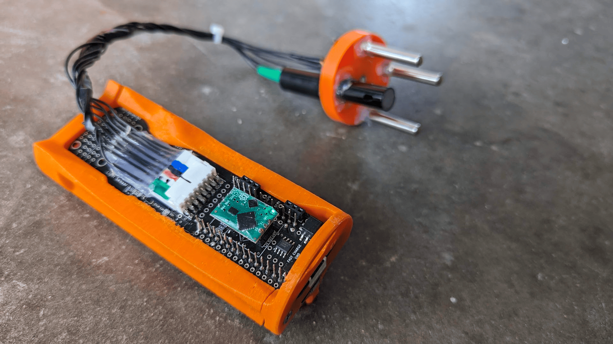

# OpenCTD SSROV / Education Edition!

This fork contains a modified version of the [OpenCTD](https://github.com/OceanographyforEveryone/OpenCTD) designed to be more reliable, easy to use, and useful as a hands-on classroom teaching tool - Developed for the [SSROV Summer Camp](https://ssrovcamp.org/) - Funding provided by the camp and the National Science Foundation

**Improvements**

- Much more reliable magnetic switch - hold to power on/off - works while fully sealed!
- Data download, calibration & configuration over USB - removes the need to take anything out of the tube or change firmware for use & calibration.
- Supports realtime plotting of sensors via the Arduino serial plotter.
- Configurable sample rate for fast response or extended battery life.
- Bright status LEDs that work in sunlight
- Includes proto space for extending with your own sensors or components.
- Built in slots for ambient lux and 9-axis orientation sensors.
- Connectors make major conmponents, mainboard and tube easily replaceable.
- Factory assembly PCB design - less soldering required and better components for very resonable prices via JLCPCB (30$ + shipping for 5 assembled boards).

**There are many other great open source CTDs used for different applications**

CTDizzle: https://github.com/IanTBlack/CTDizzle

Arduino-based Sonde: https://github.com/glockridge/DrifterApplication

OpenCTD: https://github.com/OceanographyforEveryone/OpenCTD

PiCTD: https://github.com/haanhouse/pictd

## Make your own

> Build and ordering guides comming soon

All things related to the SSROV OpenCTD are found in the [SSROV CTD](./SSROV%20CTD/) folder including:

- [Source code](./SSROV%20CTD/Software/Firmware/ssrov_ctd_code) in Arduino c++ and [pre-compiled binaries](./SSROV%20CTD/Software/Firmware/ssrov_ctd_code/build) for the Adafruit Feather Adalogger - M0 microcontroller.
- [PCB designs](./SSROV%20CTD/Hardware/Electronics/PCB/ssrov-kicad-openctd) in KiCad and exported [pcb trace & assembly files](./SSROV%20CTD/Hardware/Electronics/PCB/ssrov-kicad-openctd/production/) for ordering assembled circuit boards from JLCPCB.
- [3D Printer files](./SSROV%20CTD/Hardware/3D-Prints) and [CAD Designs](https://cad.onshape.com/documents/1210ba157fe929ee8ac86200/w/c68b7dc340291ef5042e473d/e/f126e805a19383355f9e1651) for Onshape.

Submit a github issue and let us know if you want make one or modify for your usecase! - We are happy to help!

### Development Notes:

> Please be advised that the rubber o-rings in the yellow Cherne brand endcaps is much stiffer than the rubber used in other endcap brands and has been found to fail consistently in cold water. We do not recommend using Cherne endcaps in your CTD build.
>
> Some batteries ordered from Amazon have the positive and negative termninal reversed. Please check battery polarity before attempting to power your CTD.

# OpenCTD: Oceanography for Everyone

**BELOW IS THE README FROM THE ORIGNAL OPENCTD PROJECT**

- Directions here do not nessisarily apply to ssrov CTD.

The [OpenCTD Construction and
Operation](https://github.com/OceanographyforEveryone/OpenCTD/tree/main/Documentation/Manual)
manual provides a comprehensive, step-by-step guide to building your own
OpenCTD, with a standard construction pathway as well as numerous alternatives
depending on parts availability and technical skills.

The OpenCTD [core software](https://github.com/OceanographyforEveryone/OpenCTD/tree/main/Software) is designed
to be used with an M0-style Arduino microcontroller, for which we recommend the
[Adafruit Adalogger Feather M0](https://www.adafruit.com/product/2796).

---

There is something radical about making and using your own scientific
instruments. The structure of scientific inquiry has coalesced around a model
that is, in general, both expensive and exclusive. This centralizes knowledge
production within a small circle of individuals, organizations, and
institutions who have access to substantial financial resources. This circle
rarely reflects the breadth of identities, experiences, and ways of knowing
that are most directly connected to the places being explored.

By building your own instruments to study and understand the natural world, you
are expanding the circle of knowledge production. A scientist who can make
their own instruments is not beholden to the cycles of funding and access that
constrain formal, institutional inquiry. A researcher who can build and repair
their own equipment is not dependent on the whims of academic sentiment to
decide what is and is not worthy of study. A community leader who has the tools
to create their own data does not have to wait for institutions to take notice
of an emerging crisis before taking action.

.jpg>)

**You don’t need to ask for permission to understand your world.**

Nowhere is this inequality of access more pronounced than in the ocean
sciences, where all but a few entities have the capital to mount major
oceanographic research campaigns. Even localized coastal research can be
thwarted by lack of access to vessels, equipment, and instruments. As the need
to understand the dramatic changes at the surface and beneath the waves
accelerates, baring the participation of ocean stakeholders erodes our
power to understand, anticipate, and mitigate those changes.

The ocean belongs to everyone. The tools to study the ocean should be
accessible to anyone with the curiosity and motivation to pursue that inquiry.
Chief among these tools is the workhorse of oceanography, the CTD, an
instrument that measures salinity, temperature, and depth. By these
characteristics, scientists can begin to unlock ocean patterns hidden beneath
the sea's surface.

CTDs come in a variety of shapes, sizes, and applications. Most oceanographic
research vessels have a CTD connected to a rosette platform, which houses other
instruments and collects water samples in parallel with real-time data. CTDs
are also commonly attached to fixed moorings, autonomous underwater vehicles
(AUVs), remote-operated vehicles (ROVs), and even to marine animals.

Unfortunately, commercial CTDs are expensive. The most affordable models cost
several thousand dollars. For near-shore oceanographic research on the
relatively shallow continental shelf, this cost can be prohibitive. This
effectively excludes formal researchers from low and middle income countries,
and small island states. Even in high-income countries, formal researchers at
teaching institutions or at early career stages may also find themselves priced
out of ocean research. Informal researchers such as citizen oceanographers,
educators, conservation and management practitioners and students of all levels
face severe challenges accessing expensive scientific instruments.

### Build Your Own CTD

The OpenCTD is a low-cost, open-source CTD designed for budget-restricted
scientists, educators, and researchers working in nearshore coastal ecosystems.
In these waterways, entire research projects can be conducted for less than the
cost of a commercial CTD. OpenCTD was developed by a core team of marine
ecologists in collaboration with a community of scientists, engineers, makers,
and conservation practitioners from around the world. It is assembled from
components commonly available at large hardware stores or through major online
retailers. An Arduino-based microcontroller controls an array of sensors sealed
within a PVC pipe. Power is provided by a standard 3.7V lithium polymer battery
and data are stored in a tab-delimited text file accessed via SD card. All
OpenCTD software is released open source with no restrictions on use.

The OpenCTD is designed to be built by the end-user, providing both access to
the tools of oceanography as well as the skills to maintain, repair, and
replace OpenCTDs. For scientists working in remote settings, the repairability
of the OpenCTD is intended to prevent equipment failures from spiraling into
project failures. For educators seeking novel, in-depth, hands-on STEM
experience for advanced students, the process of building an OpenCTD offers an
introduction to coding, 3D-printing, hardware prototyping, and electronics.
Construction of an OpenCTD can provide a practical foundation for courses in
oceanography and marine or environmental science.

### Core Resources

The [OpenCTD Construction and
Operation](https://github.com/OceanographyforEveryone/OpenCTD/tree/main/Documentation/Manual)
manual provides a comprehensive, step-by-step guide to building your own
OpenCTD, with a standard construction pathway as well as numerous alternatives
depending on parts availability and technical skills. A shorter manual covering just the calibration process is also available.

The OpenCTD [core software](https://github.com/OceanographyforEveryone/OpenCTD/tree/main/Software) is designed
to be used with an M0-style Arduino microcontroller, for which we recommend the
[Adafruit Adalogger Feather M0](https://www.adafruit.com/product/2796).

You can find all the Arduino libraries as described in the manual, as well as
software for calibrating the conductivity sensors in
[Support](https://github.com/OceanographyforEveryone/OpenCTD/tree/main/Software/Support).

Hardware file for both 3D printable components and the control unit PBC can be found in [Hardware](https://github.com/OceanographyforEveryone/OpenCTD/tree/main/Hardware)

**Updated 8/27/2024**
