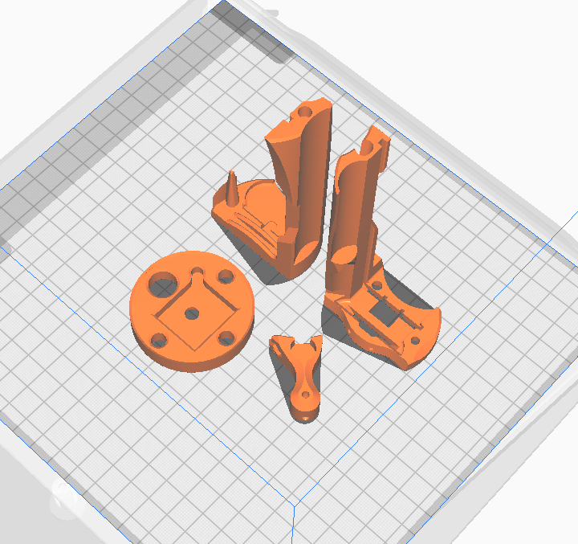

## 3D Printing the SSROV OpenCTD

Everything can be printed WITHOUT SUPPORTS if layed flat and vetical as shown in the photo above.

Print all of these files:

- [CTD Chassis Part A.3mf](<CTD Chassis Part A.3mf>)
- [CTD Chassis Part A.3mf](<CTD Chassis Part B.3mf>)
- [Mag Switch Tool.3mf](<Mag Switch Tool.3mf>)

Plus print one base plate based on which kind of pressure sensor you have:

- [OpenCTD_M0_Baseplate_SparkfunBreakout.3mf](./OpenCTD_M0_Baseplate_SparkfunBreakout.3mf) - Recommended base plate for use with Sparkfun 14Bar pressure breakout board as included in the parts list for the SSROV CTD.
- [OpenCTD_M0_Baseplate.3mf](./OpenCTD_M0_Baseplate.3mf) - For use if mounting the 14 bar Pressure sensor and adafruit breakout yourself (see build instructions in main OpenCTD github).
- [OpenCTD_M0_Baseplate_OpenROV_IMU.3mf](./OpenCTD_M0_Baseplate_OpenROV_IMU.3mf) - Not recommended, OpenRov was no longer making these at time of writing.

## Making it your own:

The CAD for the SSROV OpenCTD can be found on [Onshape](https://cad.onshape.com/documents/1210ba157fe929ee8ac86200/w/c68b7dc340291ef5042e473d/e/c499e89a301fe88104222f74) and exported in a variety of formats

For best compatibility, make sure to export the entire assembly - as refrences are used between parts.
