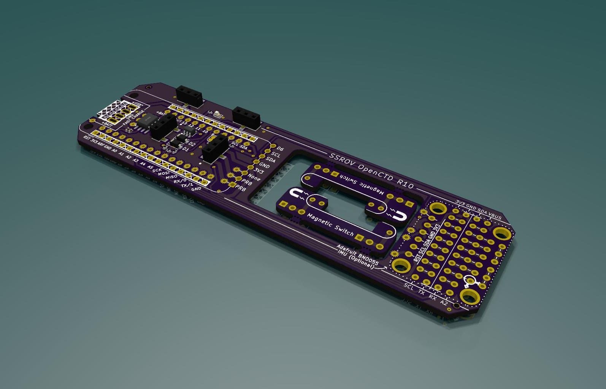
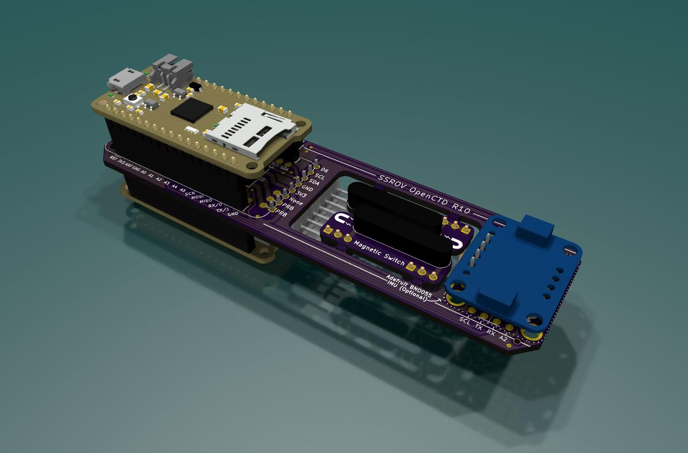

# OpenCTD SSROV PCB

The OpenCTD main board is designed using [KiCad](https://www.kicad.org/) and made to be fabricated and assembled using JLCPCB.

prebuilt gerber and assembly files can be found in [./ssrov-kicad-openctd/production/](./ssrov-kicad-openctd/production/)
video guide on ordering will be shared soon

Factory Assembled main board:

Main board after manual assembly including optional components:

