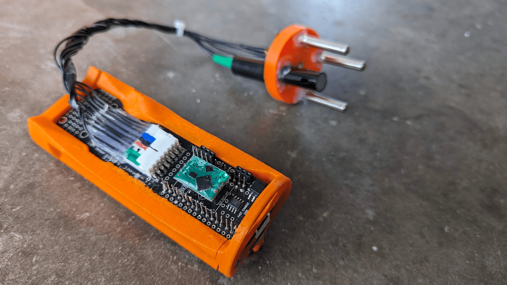

# OpenCTD Hardware

This directory contains files for building the OpenCTD. There are two general systems here:

- The "main board" electronics assembly including microcontroller, sd card, sensor interfaces, power controls, 3D printed internal frame, etc...
- The enclosure, which includes both the clear PVC tube + 3D printed
  base needed to construct the waterproof housing and the epoxied sensors + wires + connector that makes the OpenCTD an oceanographic instrument.

### Electronics

The SSROV OpenCTD is controlled by an [Adalogger Feather
M0](https://www.adafruit.com/product/2796) microcontroller development board.
Instructions on how to upload OpenCTD firmware to the microcontroller board can
be found in the [Documentation](../Documentation). General instructions and
learning resources about the Adalogger Feather M0 board itself can be found in
the [Adafruit Learning
Guide](https://learn.adafruit.com/adafruit-feather-m0-adalogger/).

The SSROV OpenCTD mainboard is made from a largely pre-assembled custom pcb. The custom PCB is designed using [KiCad](https://www.kicad.org/), and can
be ordered in small batches from JLCPCB
using the files located in the [PCB](Electronics/PCB) directory.

### Enclosure

Most of the OpenCTD enclosure is constructed from PCV tubing and plumbing components. The base should be 3d printed and permanently epoxied along with the sensors for pressure, temprerature and salinity into the enclosure tube.
